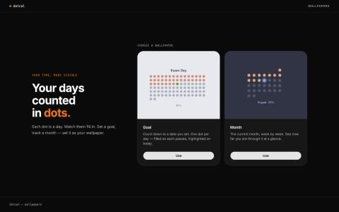

# dotcal

Lock screen wallpapers that count your days in dots. One dot per day — watch them fill in.



## Wallpapers

- **Goal** — Count down to a date you set. One dot per day, filled as each passes.
- **Month** — The current month as a grid of dots, week by week.

## Stack

- Frontend: React + Vite + Tailwind
- Backend: Node.js + Express
- Image generation: Sharp (SVG → PNG)

## Dev

```bash
# frontend
cd frontend && npm run dev

# backend
cd goalcal && node index.js
```
